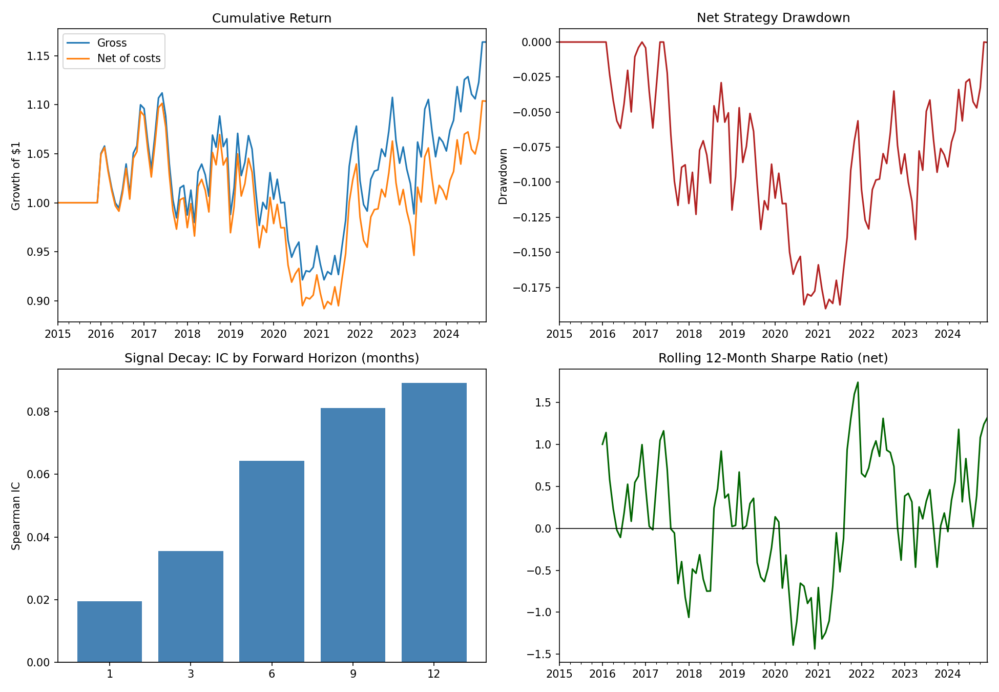

# Cross-Sectional Momentum Strategy

A cross-sectional momentum strategy built in Python across 50+ US equities.
Stocks are ranked each month by trailing 12-1 month returns; the top quintile
is bought and the bottom quintile is shorted, equal-weighted. The script also
analyses signal decay, turnover/transaction-cost drag, and performance across
bull vs. bear regimes.

## What it does

- **Signal**: 12-1 month momentum (trailing 12-month return, skipping the
  most recent month to avoid short-term reversal effects)
- **Portfolio construction**: equal-weighted long top 20% / short bottom 20%,
  rebalanced monthly, dollar-neutral
- **Signal decay**: Spearman information coefficient (IC) between the signal
  and forward returns at 1, 3, 6, 9, and 12-month horizons
- **Turnover & costs**: monthly turnover and the annualised transaction-cost
  drag at an assumed 10 bps one-way cost
- **Regime analysis**: performance split into bull vs. bear months based on
  trailing 6-month market return

## Usage

```bash
pip install -r requirements.txt
python momentum_strategy.py
```

By default the script pulls real daily prices via `yfinance` for the tickers
in `TICKERS`. If that fails (no internet, rate limiting, etc.) it
automatically falls back to simulated regime-switching price data so the
script still runs end-to-end and produces sensible output.

Output includes a console performance summary plus a saved chart
(`momentum_results.png`) with cumulative return, drawdown, signal decay, and
rolling Sharpe ratio.

## Notes / caveats

- This is a research script, not a production trading system — no
  slippage/market-impact modelling beyond a flat bps cost, no borrow costs
  for the short leg, and no position limits.
- Momentum strategies are well known to suffer sharp "momentum crashes"
  during market rebounds after a crash; the regime analysis here is a simple
  illustration of that sensitivity, not a rigorous crash-timing study.
